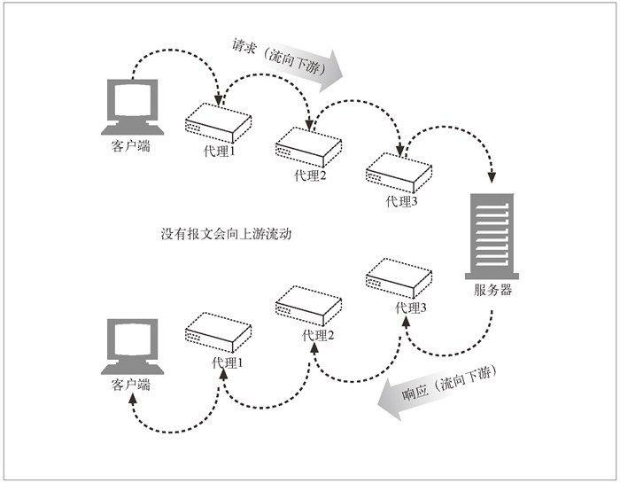

# MIME

MIME 类型 (Multipurpose Internet Mail Extension) 是一种文本标记，表示一种主要的对象类型和一个特定的子类型，中间由一条斜杠来分隔。

- html 文档 text/html
- jpeg 图片 image/jpeg
- gif 图片 image/gif
- ...

# URI

统一资源标识符 (Uniform Resource Identi?er)，在世界范围内唯一标识并定位信息资源。

# URL

统一资源定位符，现在，几乎所有的 `URI` 都是 `URL`

> https://wikipedia.org/wiki/Hypertext_Transfer_Protocol

一个常见的 `URL` 由三部分组成

- 协议头 （ https:// ）
- 服务器所在域因特网地址 （wikipedia.org）
- 指定服务器上的某个资源 （/wiki/Hypertext_Transfer_Protocol）

# URL 的编码机制

为了避开安全字符集带来的限制，设计了一种编码机制，用来在 `URL` 中表示各种不安全的字符。这种编码机制是通过一种“转义”表示法来表示不安全字符的，这种表示法包含一个百分号（`%`），后面跟着两个表示字符 ASCII 码的十六进制数

> https://www.baidu.com/s?wd=%E8%B0%B7%E6%AD%8C

# 代理

关于 Web 代理（Proxy） 我们首先会想到 `VPN` 这类应用。代理服务器是代表客户端完成事务处理的中间人，所以代理服务器既是 Web 服务器又是 Web 客户端。

# 报文和实体

报文是快递盒子，实体是货物。