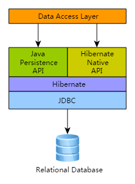
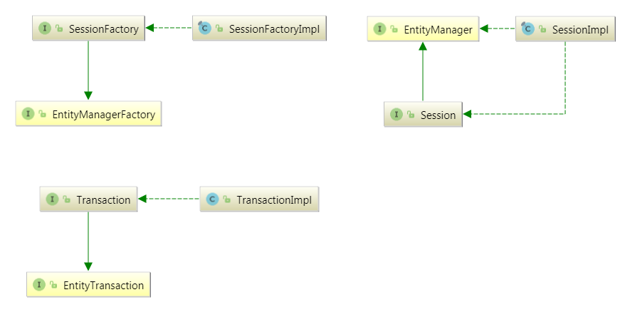

# Hibernate


#### 	架构



Hibernate实现了 JPA (Java Persistence API) 规范，JPA 接口和 Hibernate 特定实现之间的关联可以在下图中可视化： 




#### Hibernate 将类型分为两种

- value type
- entity type

value type 在 `Hibernate` 中有三种子类别

- 基本类型
  - 可以由 `Hibernate` 在 Java Bean 与 DB 之间转换的数据类型
- 可嵌入的类型由 `@Embeddable` 注解的对象作为 Java Bean 的属性
- 集合类型


#### 实体映射

可以有用户显式制定（使用 `@Table` 或 `@Column`）, 也可以由 Hibernate 通过 [ImplicitNamingStrategy](http://docs.jboss.org/hibernate/orm/5.3/userguide/html_single/Hibernate_User_Guide.html#ImplicitNamingStrategy) 契约隐式确定 。 

其中 JPA 定义的隐式命名规则务必坚持使用 `ImplicitNamingStrategyJpaCompliantImpl`（默认值） 


#### @Basic

javax.persistence.Basic , 通常 `@Basic` 可以省略，`@Basic` 将实体的成员标记为 Hibernate 的基础类型


JPA 规范严格的限制了可以被标记为 `@Basic` 的 Java 类型：

- Java基本类型（`boolean`，`int`，等） 
- 包装的原始类型（`java.lang.Boolean`，`java.lang.Integer` 等） 
- java.lang.String 
- java.math.BigInteger 
- java.math.BigDecimal 
- java.util.Date 
- java.util.Calendar 
- java.sql.Date 
- java.sql.Time 
- java.sql.Timestamp 
- `byte[]` 要么 `Byte[]` 
- `char[]` 要么 `Character[]` 
- enums 
- 实现的任何其他类型 `Serializable` （JPA对 `Serializable` 类型的“支持” 是直接将其状态序列化到数据库）。 

#### 计算属性

```java
@Formula("lastLoginTime - createTime")
private long joinTime;
```


#### @CreationTimestamp 与 @UpdateTimestamp

创建时间和更新时间自动维护


#### 官方指南

http://docs.jboss.org/hibernate/orm/5.3/userguide/html_single/Hibernate_User_Guide.html